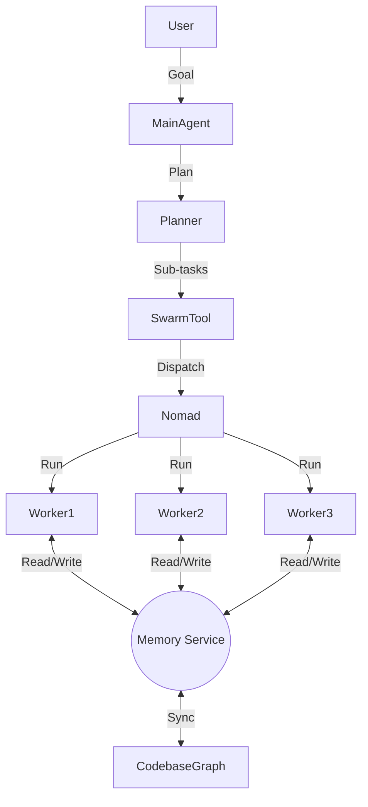

# Frontier Agent Roadmap

This document outlines the architectural roadmap to evolve the current Pipecat-based agent system into a "Frontier Agent" system, characterized by persistent memory, multi-repo autonomy, and scalable agent swarms.

## 1. Vision

The goal is to transition from a single-session, user-driven assistant to an autonomous, multi-agent system capable of:

* **Persistent Context:** Maintaining a "Shared Brain" of the codebase and project history across all agent instances.
* **Elastic Scaling:** Spawning ephemeral "worker" agents to parallelize tasks (e.g., "Refactor these 10 microservices").
* **Multi-Repo Orchestration:** Understanding and modifying dependencies across a distributed microservice architecture.

## 2. Gap Analysis

| Feature | Current State | Target State (Frontier) |
| :--- | :--- | :--- |
| **Memory** | `PMMMemory`/`MemoryStore` uses local files (SQLite/JSON) locked to a single container. | **Shared Knowledge Graph Service:** A centralized, API-accessible service (Vector DB + Graph) that all agents read/write to. |
| **Scaling** | Single `pipecatapp` container; `supervisor` heals system jobs but doesn't spawn task agents. | **Swarm Orchestration:** The main agent can dispatch N "Worker Agents" as ephemeral Nomad jobs to run in parallel. |
| **Context** | Agent knows about the current chat and limited RAG snippets. | **Codebase Map:** A structured map of Repos $\leftrightarrow$ Services $\leftrightarrow$ Files, allowing high-level intent planning. |
| **Tooling** | Tools operate on the local container or via simple SSH. | **Distributed Tools:** Tools that can clone/push specific repos to ephemeral workspaces and report back. |

## 3. Implementation Plan

### Phase 1: Foundation (Immediate)

* **Swarm Tool:** Implement a tool allowing the main agent to dispatch generic "Worker" jobs to Nomad.
* **Worker Template:** Create a lightweight Docker image/Nomad job template for these workers.
* **Roadmap:** This document.

### Phase 2: The "Shared Brain" (Memory Service)

* **Migrate Memory:** Move `PMMMemory` logic from a library class to a standalone REST API service (`memory-service`).
* **Vector DB:** Replace local FAISS with a proper server (e.g., Qdrant, Weaviate, or a wrapping service around FAISS) to allow concurrent access.
* **Context Injection:** Worker agents start by pulling relevant context from this shared service.

### Phase 3: The "Planner" & Knowledge Graph

* **Project Mapper:** A tool/cron job that scans all repos and builds a dependency graph (Service A calls Service B).
* **Planner Expert:** A specialized LLM capability that takes a high-level goal ("Update Auth") and uses the Project Map to generate sub-tasks ("Update `auth-service`", "Update `user-service`").
* **Recursive Decomposition:** The Planner delegates these sub-tasks to the Swarm Tool.

### Phase 4: Continuous Evolution

* **Feedback Loop:** Workers report success/failure/metrics to the Shared Brain.
* **Self-Correction:** The Supervisor monitors not just job health, but *task progress*, restarting stuck agents with new strategies.

## 4. Architecture Diagram (Target)

