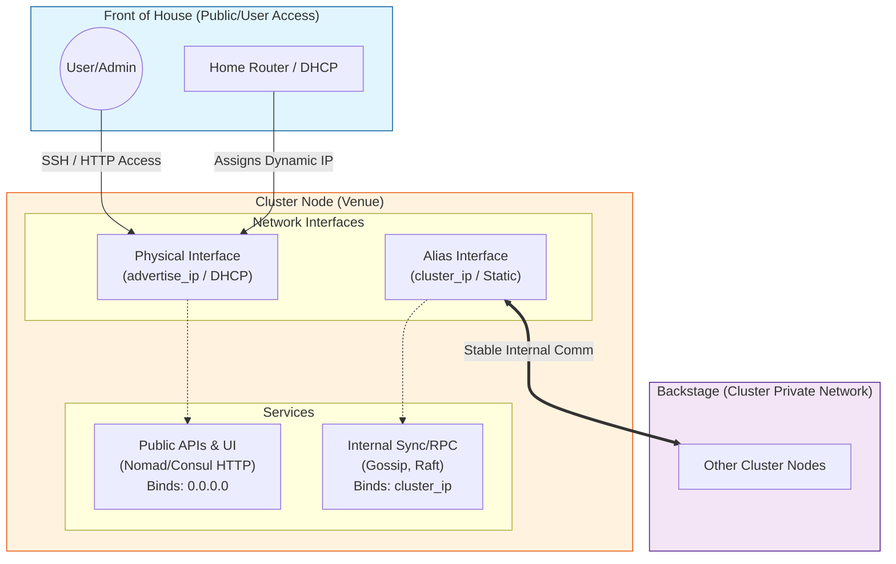

# Network Architecture

The cluster utilizes a "Dual Network" architecture to ensure stability, isolation, and accessibility. This design separates internal cluster communication from external management and user access.

## Mental Model: Front of House vs. Backstage

To understand this structure, it helps to visualize the cluster node as a venue:

### 1. `advertise_ip` = Front of House (Public / User Access)

* **What it is:** The IP assigned by your home router (e.g., `192.168.1.55`).
* **Behavior:** It acts like a **Billboard**. It changes whenever your router feels like it (DHCP), but it's the only way *you* (the audience) can enter the building.
* **Use Case:** SSH, Web Browsers (Consul UI, Nomad UI), Home Assistant Dashboards.
* **Why it's unstable:** If this IP changes, the "Billboard" moves, and you have to find it again. But the show inside shouldn't stop.

### 2. `cluster_ip` = Backstage (Private / Internal Sync)

* **What it is:** The static IP created on the alias interface (e.g., `10.0.0.10`).
* **Behavior:** It acts like a **Walkie-Talkie channel**. It is hard-coded and never changes.
* **Use Case:** Nomad Client talking to Nomad Server, Consul syncing data, Raft Consensus.
* **Why it's stable:** Even if the "Billboard" (`advertise_ip`) changes or the front door moves, the band members (nodes) can still keep playing because they are on a dedicated, static channel.

### Visual Diagram

---

## Technical Implementation

### 1. Network Segmentation

#### A. Public / Management Network (DHCP)

* **Interface:** The primary physical or bridged interface.
* **Variable:** `advertise_ip` (Ansible fact `default_ipv4.address`).
* **Role:** External accessibility.

#### B. Cluster / Private Network (Static Virtual Subnet)

* **Interface:** IP alias on the primary interface.
* **Variable:** `cluster_ip` (Derived from Hostname).
* **Role:** Internal stability.

### 2. Addressing Scheme

Nodes are assigned a deterministic `node_id` based on their hostname, which sets the last octet of their Cluster IP.

| Hostname | Node ID | Cluster IP | Role |
| :--- | :--- | :--- | :--- |
| `devbox` | 10 | `10.0.0.10` | Single-node Dev Cluster |
| `worker1` | 11 | `10.0.0.11` | Worker Node |
| `worker2` | 12 | `10.0.0.12` | Worker Node |
| `pxe-server` | 1 | `10.0.0.1` | PXE / Gateway |

**Formula:** `cluster_ip = "10.0.0." + node_id`

### 3. Service Configuration

#### Consul

* **Bind Address:** `cluster_ip` (Listens for internal gossip/RPC).
* **Client Address:** `0.0.0.0` (Listens for API/UI requests on all interfaces).
* **Retry Join:** Uses `cluster_ip` of controller nodes.

#### Nomad

* **Bind Address:** `cluster_ip`.
* **RPC/Serf Address:** `cluster_ip`.
* **HTTP API:** Listens on `0.0.0.0` (Publicly accessible).
* **Advertise HTTP:** `advertise_ip` (So the UI links point to the reachable public IP).
