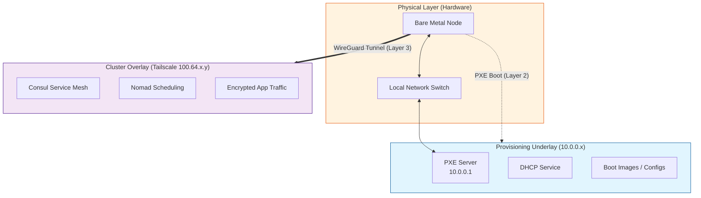

# Network Architecture

The cluster utilizes a **Tiered Network Architecture** designed to support nodes throughout their entire lifecycle, from bare-metal provisioning to production service mesh participation.

This design separates the **hardware initialization** phase from the **application runtime** phase.

## Mental Model: Underlay vs. Overlay

To understand this structure, visualize the network as two distinct layers:

### 1. The Provisioning Underlay (`10.0.0.x`)

* **What it is:** The "Hardware-Level" network. It operates on Layer 2 (LAN) and does not rely on complex software stacks.
* **Primary Role:** **Bootstrapping & Fallback.**
* **Key Use Case:** **PXE Booting.** New nodes (defined in `pxe_subnet`) need a simple, deterministic local network to pull boot images and initial configurations before an OS is installed.
* **Why not Tailscale?** Tailscale requires an OS and a running daemon. You cannot easily use it inside an iPXE environment or during the early stages of an OS install.
* **Secondary Role:** Functions as a "Backstage" sync channel if the internet is down or the overlay mesh fails.

### 2. The Cluster Overlay (`100.64.x.y`)

* **What it is:** The "Production-Level" network provided by **Tailscale**.
* **Primary Role:** **Secure Service Mesh.**
* **Key Use Case:** Secure, encrypted communication between Nomad, Consul, and application services.
* **Behavior:** Once a node is fully provisioned and the Tailscale daemon starts, the system promotes this interface to be the primary `cluster_ip`.
* **Reachability:** Enables seamless cross-site connectivity (e.g., spanning different physical locations or subnets) without complex firewall rules.

### Visual Diagram



---

## Technical Implementation

### 1. Network Segmentation

#### A. Provisioning Underlay (10.0.0.x)

* **Interface:** Physical Ethernet or Bridge.
* **Addressing:** Static or DHCP reserved based on MAC address.
* **Status:** Always available (Layer 2).

#### B. Cluster Overlay (Tailscale)

* **Interface:** `tailscale0`
* **Addressing:** CGNAT range (`100.64.0.0/10`) assigned by Tailscale.
* **Status:** Available post-boot.

### 2. Variable Logic (`group_vars/all.yaml`)

The system dynamically selects the `cluster_ip` based on the node's state:

1.  **Check for Tailscale:** If the `tailscale0` interface exists, its IP is used as the `cluster_ip`.
2.  **Fallback:** If `tailscale0` is missing (e.g., during early boot or if Tailscale is disabled), it falls back to the static `10.0.0.x` alias derived from the hostname.

```yaml
# Simplified Logic
cluster_ip: "{{ ansible_facts.get('tailscale0', {}).get('ipv4', {}).get('address', '10.0.0.' + node_id) }}"
```

### 3. Service Configuration

#### Consul & Nomad

* **Bind Address:** `cluster_ip` (Prefers Tailscale).
* **Benefit:** Traffic between nodes is automatically encrypted by WireGuard (Tailscale), removing the need for complex mTLS setups for basic node-to-node security.

### 4. Addressing Scheme (Fallback/Underlay)

When operating on the underlay, nodes use a deterministic ID:

| Hostname | Node ID | Underlay IP | Role |
| :--- | :--- | :--- | :--- |
| `devbox` | 10 | `10.0.0.10` | Single-node Dev Cluster |
| `worker1` | 11 | `10.0.0.11` | Worker Node |
| `pxe-server` | 1 | `10.0.0.1` | PXE / Gateway |

**Formula:** `Underlay IP = "10.0.0." + node_id`
