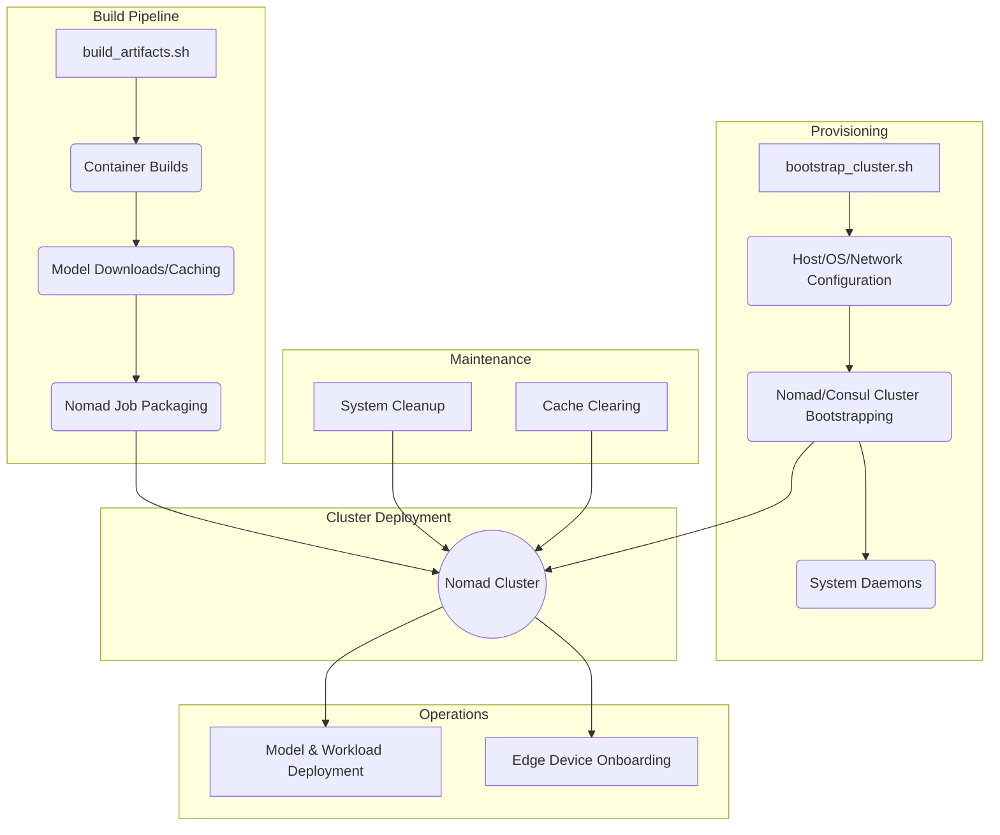

# Operations Manual

Welcome to the operations manual for the repository. This manual covers key operational flows to maintain, scale, and manage the system.

## Table of Contents
1. [Architecture Flowchart](#architecture-flowchart)
2. [Host/Node Provisioning](#hostnode-provisioning)
3. [Edge Device Onboarding](#edge-device-onboarding)
4. [Model & Workload Deployment](#model--workload-deployment)
5. [Maintenance & Lifecycle](#maintenance--lifecycle)

## Architecture Flowchart



## Host/Node Provisioning

Bootstrapping a bare-metal server or VM into the cluster involves setting up the OS, network, and joining the Nomad/Consul cluster.

### Steps:
1. **Initial Setup:** Use the `bootstrap_cluster.sh` script to configure the host.
   ```bash
   ./bootstrap.sh --cluster-only
   # or natively
   ./bootstrap_cluster.sh
   ```
2. **Network & OS:** This configures the bridge networking, TLS certificates, and essential host packages.
3. **Cluster Joining:** The node will automatically join the Consul and Nomad clusters using the configurations provisioned by Ansible under `ansible/roles/nomad` and `ansible/roles/consul`.

## Edge Device Onboarding

Enrolling edge nodes or clients to interact with Nomad and services securely.

### Steps:
1. **Device Registration:** Provision TLS certificates for the edge device to communicate securely.
2. **Agent Configuration:** If running lightweight edge jobs, install a Nomad client pointing to the control plane.
3. **Networking:** Ensure Headscale/Wireguard networking allows the edge node to route to the cluster IPs.

## Model & Workload Deployment

Pulling/serving models via Nomad/Consul allocations and deploying jobs.

### Steps:
1. **Build Artifacts:** Run the artifact build pipeline to package jobs and models.
   ```bash
   ./bootstrap.sh --build-only
   # or natively
   ./build_artifacts.sh
   ```
2. **Nomad Job Submission:** Use the generated Nomad job specs (`.nomad` files) to submit workloads.
   ```bash
   nomad job run -var-file=... path/to/job.nomad
   ```
3. **Model Weights:** The build pipeline downloads GGUF files and pins them to IPFS or loads them into host volumes to be consumed by services (e.g., Moshi, Llama.cpp).

## Maintenance & Lifecycle

Cache clearing, disk recovery procedures, and cluster teardown/rebuild.

### Cleanup Commands
To reclaim disk space if the system hits a disk space ceiling (e.g. `No space left on device`):
```bash
# Aggressive system cleanup
sudo ./bootstrap.sh --system-cleanup -y

# Prune docker
docker system prune -af --volumes

# Clear UV and Ansible caches
uv cache clean
rm -rf /var/tmp/ansible_pip_build /tmp/* ~/.ansible_async
```

### Regular Maintenance
- Periodically clear old virtual environments and dangling Docker layers.
- Check Nomad and Consul health metrics.
